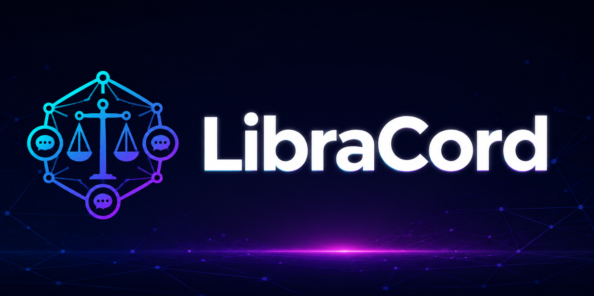
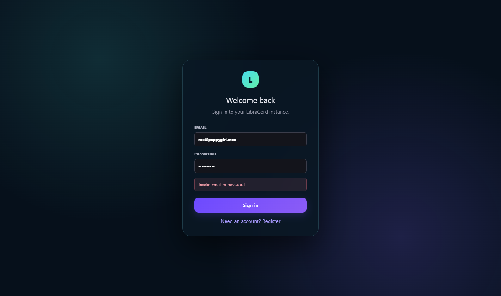
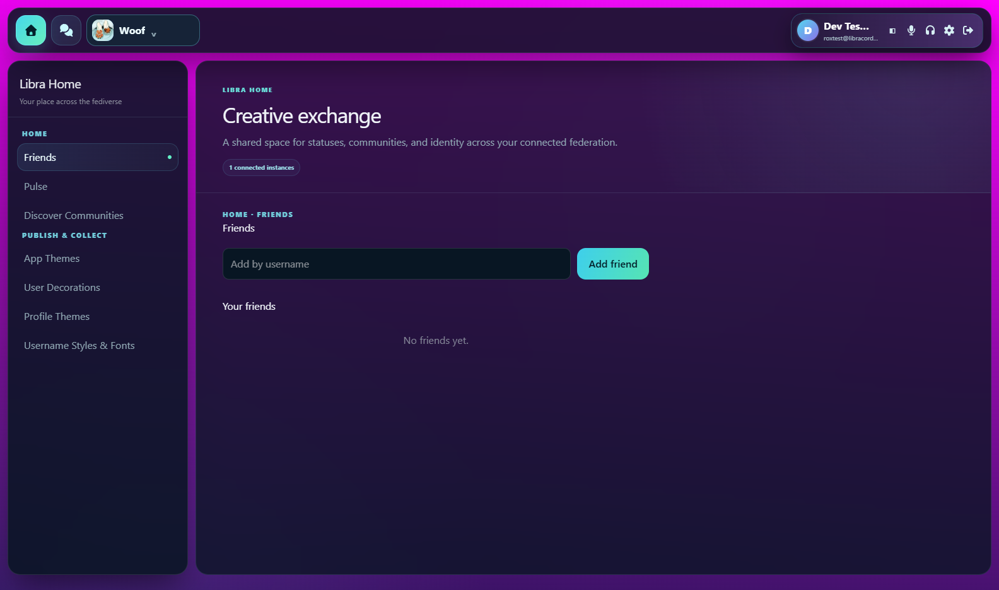
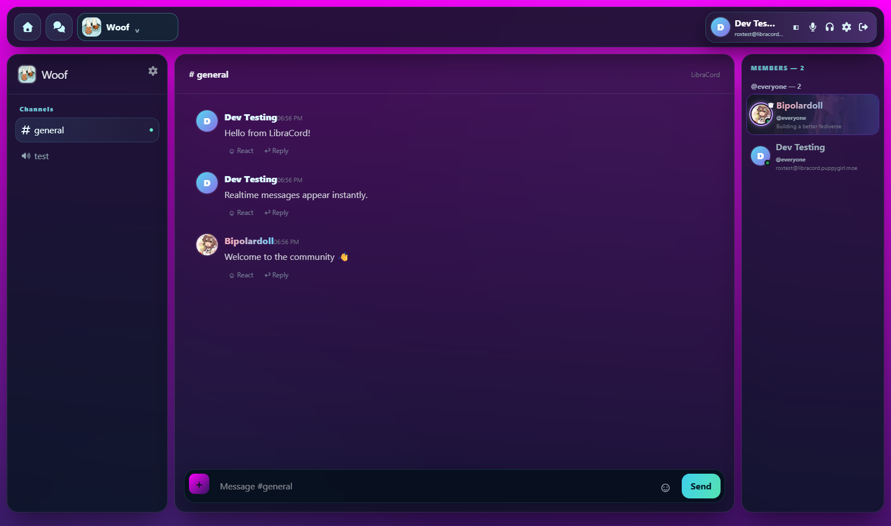
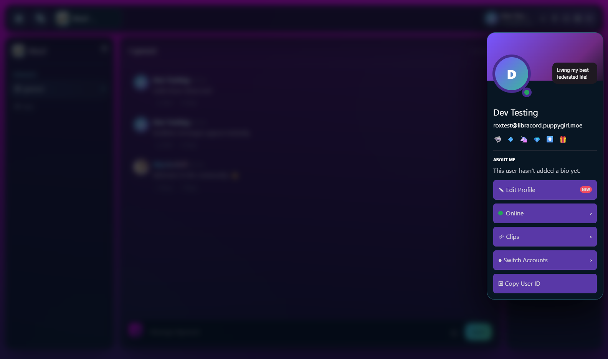
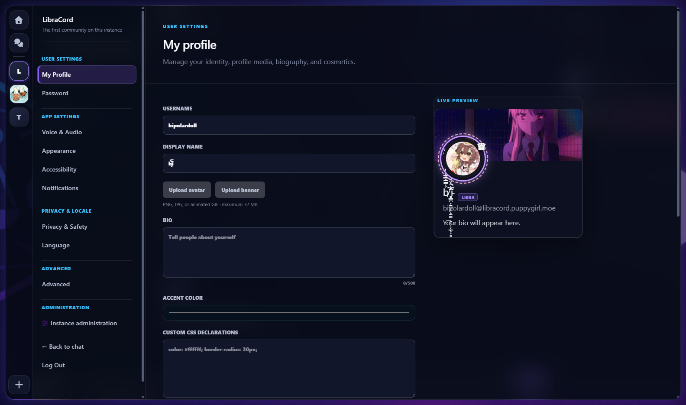

# LibraCord

<p align="center">
  
</p>

[](https://github.com/RoxyBoxxy/LibraCord/actions/workflows/ci.yml)
[](https://github.com/RoxyBoxxy/LibraCord/actions/workflows/desktop-build.yml)

LibraCord is a self-hosted, federated community chat experiment inspired by Discord. It combines persistent text channels, direct messages, voice/video rooms, screen sharing, community administration, profile customization, and public instance discovery in one Vue and Node.js application.

> [!WARNING]
> LibraCord is an alpha/MVP. Signed federation and encrypted cross-instance DM transport are implemented, but neither the protocol nor the client cryptography has received an independent security audit. Use controlled peers while the protocol stabilizes.

## Highlights

- Communities with categories, text/voice channels, members, roles, permission overrides, invites, and webhooks
- Real-time messages, typing indicators, presence, profile changes, and community updates through Socket.IO
- Friends and persistent direct-message conversations with call invitations
- LiveKit voice, webcam, screen sharing, application audio, and optional RTMP/WHIP ingress
- Electron desktop client with native screen-source selection and configurable hardware acceleration
- Avatars, banners, animated GIFs, image cropping, profile themes, decorations, and stackable username styles
- Signed federation with durable remote memberships, idempotent delivery, offline reconciliation, replicated community policy, portable identities, and peer trust controls
- Optional shared browser desktop
- One root `.env` and one Docker Compose project for quick hosting

## Screenshots

| Federated home and Pulse | Friends |
| --- | --- |
|  |  |

### Community chat



| Profile | Profile customization |
| --- | --- |
|  |  |

## Stack

| Layer | Technology |
| --- | --- |
| Web client | Vue 3, Vite, Tailwind CSS |
| API and realtime | Node.js, Express 5, Socket.IO |
| Storage | SQLite and filesystem-backed uploads |
| Voice and video | LiveKit with Redis |
| Desktop | Electron |
| Deployment | Docker Compose, Nginx Proxy Manager compatible |

## Architecture

```text
Web browser / Electron
        |
        | HTTPS + WebSocket
        v
Reverse proxy :443
   |                    |
   | app traffic        | /rtc and /twirp
   v                    v
LibraCord :3002      LiveKit :7880
   |                    |
   |                    +-- direct RTC TCP/UDP and TURN/UDP
   +-- SQLite/uploads   +-- Redis
   +-- Socket.IO
   +-- optional browser service
```

The production image serves the built Vue application, REST API, uploads, and Socket.IO from the same HTTP port. LiveKit signaling can share the public hostname through proxy paths, but WebRTC media ports must be exposed directly.

## Quick start for development

Requirements:

- Node.js 24 or newer
- npm
- Docker Desktop or Docker Engine with Compose

```powershell
Copy-Item .env.example .env
npm install
.\start-dev.ps1
```

The helper starts Redis, LiveKit, ingress, and the optional browser services from the root Compose file, then starts the API and Vite client. Open `http://localhost:5173`.

On Linux/macOS, start dependencies and the app separately:

```sh
cp .env.example .env
docker compose --profile ingress --profile browser up -d redis livekit ingress browser-service browser-desktop
npm install
npm run dev
```

Run only the web/API development processes with `npm run dev`, or open the Electron shell with `npm run desktop` after Vite is running.

## Quick Docker deployment

```sh
cp .env.example .env
# Edit every production URL and generate a unique LiveKit secret.
docker compose config --quiet
docker compose up -d --build
curl http://127.0.0.1:3002/health
```

Optional services are activated with profiles:

```sh
docker compose --profile ingress --profile browser up -d --build
```

At minimum, configure `CLIENT_ORIGIN`, `PUBLIC_URL`, `FEDERATION_DOMAIN`, `DESKTOP_HOME_SERVER`, `LIVEKIT_URL`, `LIVEKIT_API_KEY`, and `LIVEKIT_API_SECRET`. Keep `.env` private.

For a public deployment, follow the [deployment guide](docs/deployment/README.md). It covers DNS, TLS, Nginx Proxy Manager, media ports, TURN, persistent data, upgrades, and backups.

## Commands

| Command | Purpose |
| --- | --- |
| `npm run dev` | Start API and Vite development servers |
| `npm run desktop` | Start the Electron desktop shell |
| `npm run desktop:dist:windows` | Build Windows installer and portable desktop artifacts |
| `npm run desktop:dist:linux` | Build a Linux AppImage |
| `npm run build` | Build the Vue production bundle |
| `npm start` | Start the Node server |
| `npm test` | Run the server test suite |
| `docker compose up -d --build` | Start the core production stack |
| `docker compose logs -f app livekit` | Follow application and media logs |

## Repository layout

```text
client/             Vue web client and visual assets
server/             Express API, Socket.IO, SQLite, federation, and tests
desktop/            Electron main process, preload bridge, and server picker
browser-service/    Shared-browser orchestration API
browser-desktop/    Containerized browser/noVNC desktop
docs/               Architecture, API, deployment, security, and operations
docker-compose.yml  Unified core and optional service profiles
Dockerfile          Production application image
.env.example        Safe configuration template
```

Generated builds, dependencies, runtime databases/uploads, logs, private environment files, and downloaded local LiveKit tools are intentionally ignored by Git.

## Documentation

- [Documentation index](docs/README.md)
- [Architecture](docs/architecture.md)
- [Local development](docs/development.md)
- [REST API](docs/API.md)
- [Realtime events](docs/realtime.md)
- [Voice, video, and screen sharing](docs/media.md)
- [Electron desktop client](docs/desktop.md)
- [Federation](docs/federation.md)
- [Security model](docs/security.md)
- [Production deployment](docs/deployment/README.md)
- [Troubleshooting](docs/deployment/troubleshooting.md)

## Federation status

LibraCord currently exposes `/.well-known/libracord` and supports explicitly allowed peers for public discovery, public feed aggregation, community catalogs, and proxied/cached public assets. Stable remote membership, signed and replay-protected server-to-server events, cross-instance moderation, identity portability, and private federated DMs are not implemented yet. See [Federation](docs/federation.md) before exposing an instance publicly.

## Security and data

Passwords are salted and hashed with Node's `scrypt`; browser authentication uses an HTTP-only session cookie. SQLite, uploaded media, and Redis state are stored in Docker named volumes. Direct messages contain client-side encrypted payloads when the clients have exchanged keys, but the current design is experimental and should not be described as audited end-to-end encryption.

Read the [security guide](docs/security.md), use TLS, restrict internal ports, rotate any secret that has been posted publicly, and test backups before relying on an instance.

## Contributing

Run `npm test` and `npm run build` before submitting a change. Keep API behavior, realtime events, and deployment documentation in sync with code changes. No open-source license has been published in this repository yet, so normal copyright restrictions apply until a license is added.
